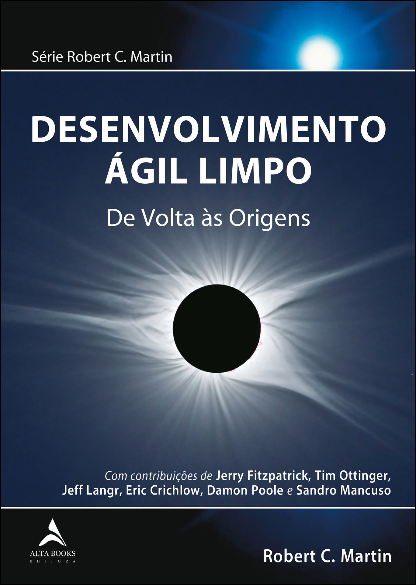
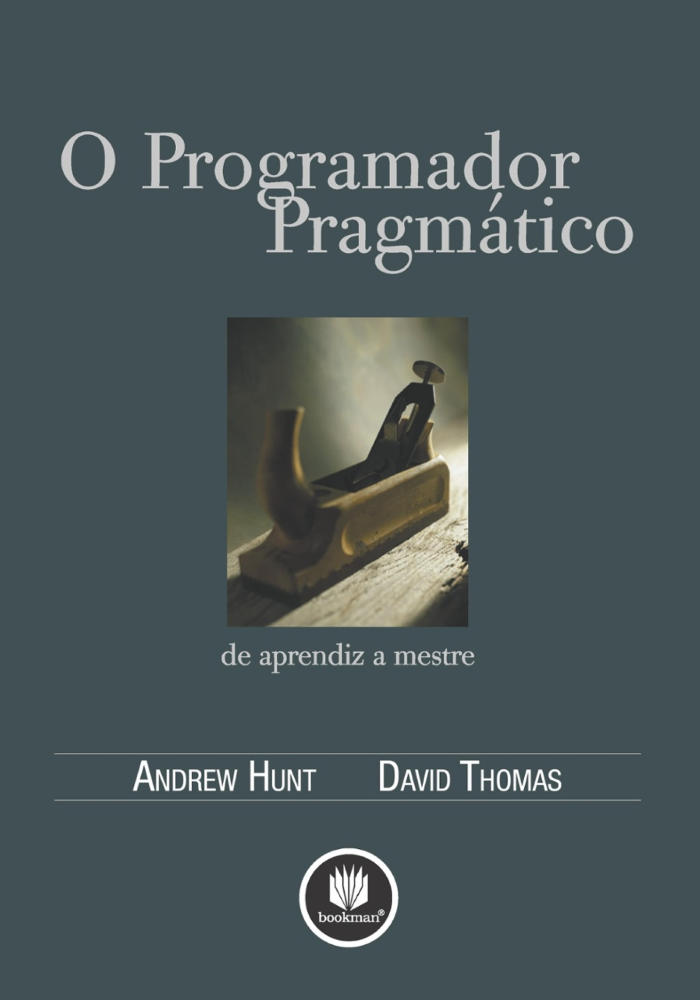

# Etreme Programming (XP)

## Programação Extrema

- Metodologia ágil focada em desenvolvimento de software
- Descrita em 1996 por Kent Back
- Popularizada em 2000
- Inspirou o manisfesto ágil

<div align="center">
    
    <p>Kent Beck Criador do XP</p>
</div>

<div align="center">
    
    
    
    <p>Livros Sobre XP</p>
</div>
<hr/>

## Baseado em Valores e Práticas

### Valores

- Feedback
- **Comunicação**
- Simplicidade
- Coragem

### Práticas

- Cliente Presente
- Jogo do Planejamento
- Stand up metting
- **Programação em Par**
- **Desenvolvimento Guiado Pelos Testes**
- **Refactoring**
- Código Coletivo
- Código Padronizado
- **Designe Simples**
- Metáfora
- Ritmo Sustentável
- Integração Contínua
- Releases Curtos

<hr/>

## Dia a dia

### Estória (User Story)

> Escrita pelo PO representa a vontade do usuário


### Caso de teste (Test Case)

> Escrita pelo QA


### Desenvolvimento Guiado a testes (TDD)

#### Passo 1 - Função soma sem implementação

> Implementar apenas o básico para poder escrecer os testes. Os testes devem falhar.

```py
def soma(valor1, valor2):
    return 0

assert soma(1, 1) == 2
```

> Erro

#### Passo 2 - Implementar função

> Implementar código para fazer os testes passarem

```py
def soma(valor1, valor2):
    return valor1 + valor2

assert soma(1, 1) == 2
```

> Sem erro

#### Passo 3

> Escreve os testes

```py
def exibe_mensagem(valor):
    return False

assert exibe_mensagem("123456")
assert not exibe_mensagem("12345")
```

> Erro

#### Passo 4

> Faz os testes passar

```py
def exibe_mensagem(valor):
    return len(valor) > 5

assert exibe_mensagem("123456")
assert not exibe_mensagem("12345")
```

> Sem erro
